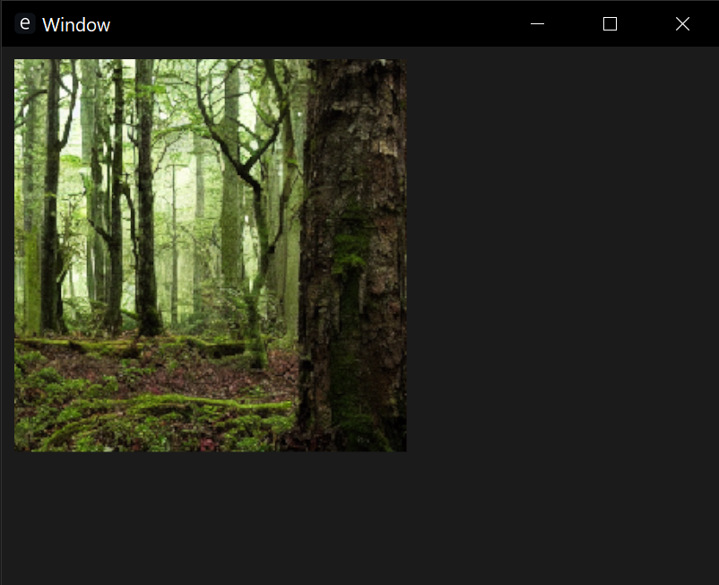

# egui-image-exmaple

## Overview

This was created to demonstrate a barebones usage of displaying an image in Rust using EGUI.

I found that there was a scattering of different ways to display images in EGUI, and that there were very few helpful examples. [This seeks to help tackle that problem by adding another scattered example](https://xkcd.com/927/).

There is a specific want to avoid any macros, as EGUI docs like to recommend, in order to allow more dynamic of image loading. This is why bytes-based usage is followed, as it allows for EGUI context-based loading alongside EGUI_Extras' helpful loaders. It also seeks to be written as a standalone app - rather than the many context-less snippets that exist - to balance between being simple enough to teach while maintaining enough standard "bulk" to still be usefully understandable under real projects.

## Screenshot

## Contact

Email benjamin.w.massey@gmail.com for any questions / inquiries.
